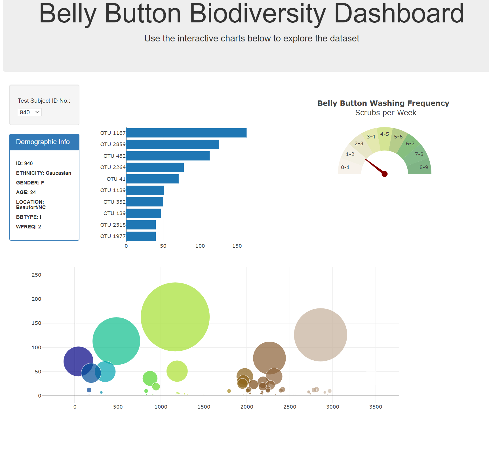
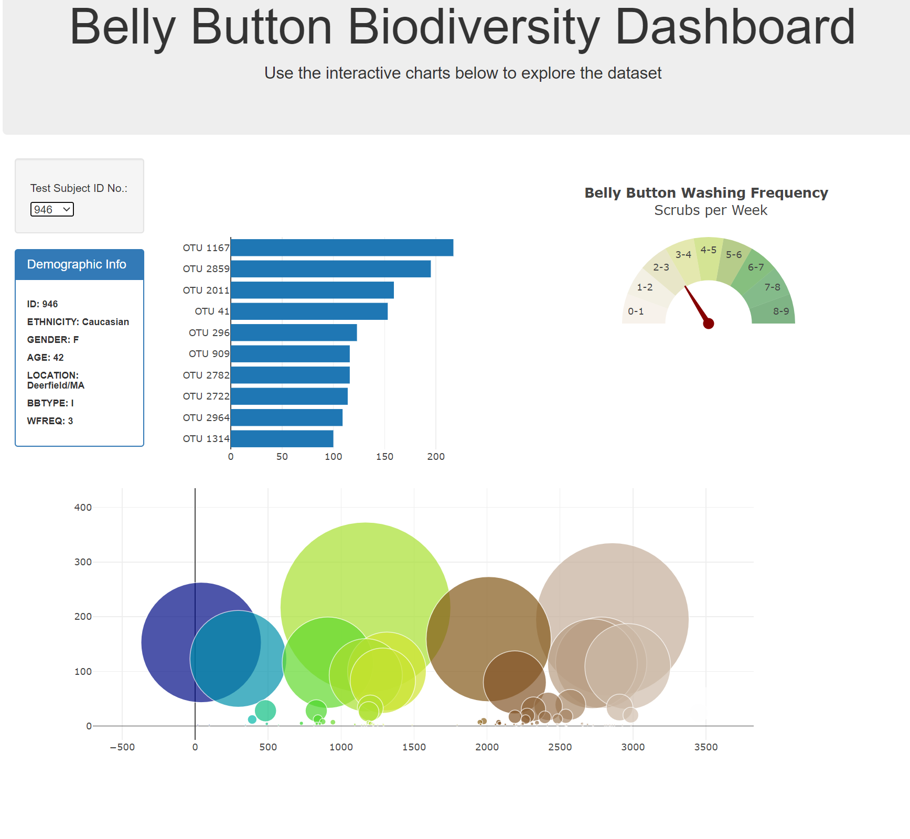

# BellyButtonBiodiversity
This project creates a dash board for belly button biacteria for provided sample
### Summary
* As soon as page loads it will take first ID from dorop down and populate all three chart defined below.
* Project displays demographic information for the IDs. Acording to selected ID it shows bar graph of the top ten bacterial species in a volunteer’s navel.
* Polts bubble chart for selected ID to visualize the relative frequency of all the bacterial species found in a volunteer’s navel.
* Create gauge chart for selected ID's washing frequency.
* To achive this goal we have used JavaScript, Plotly and HTML
### Example
#### 940 

#### 946 

#### 960 

